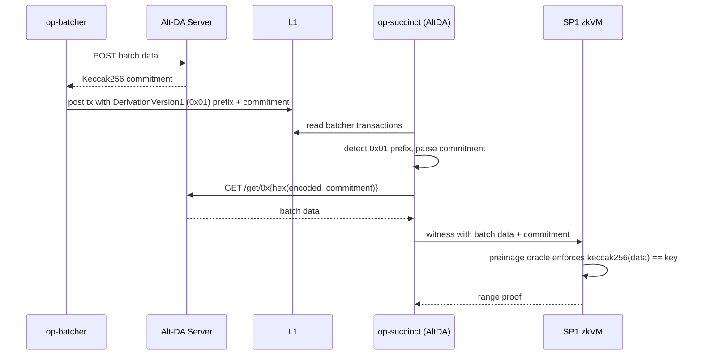

# Alt-DA Server

<div class="warning">

This feature is under active development. Breaking changes to configuration and on-chain parameters may occur between releases. Review release notes before upgrading.

</div>

## Overview

OP Succinct supports OP Stack chains that use the [alt-DA spec](https://specs.optimism.io/experimental/alt-da.html) with a generic op-alt-da server. Specialized DA backends like Celestia and EigenDA also build on the alt-DA pathway but have their own integrations and pages; this page covers the generic-server case only. The most common deployment pattern is a **validium**: an L2 that posts batch data to an off-chain DA layer and only commitments to L1. The underlying transport does not require that trust model. In this codebase the feature is named `altda`; this page uses "AltDA" to refer to the implementation ("Alt-DA Server" in the page title is the OP Stack spec terminology).

In AltDA mode, chain-layer responsibilities (derivation, validity proving, on-chain settlement) are handled by op-succinct. The data availability layer (the alt-DA server that stores batch data and serves it by commitment) is operated separately and is out of scope for this repository.

## Architecture



The OP Succinct proposer reads L1 calldata as usual. When a batcher transaction is prefixed with the `DerivationVersion1` byte (`0x01`), the AltDA data source parses the commitment and emits an `altda-commitment` hint to the host. The host fetches the corresponding batch data from the configured alt-DA server. The resolved data is loaded into the preimage oracle, where the SP1 zkVM verifies that `keccak256(data) == commitment` before accepting it into derivation.

### Out of scope

- The alt-DA server itself (storage, replication, availability guarantees).
- Generic-commitment-type encoding.
- On-chain DA challenge / bonding logic.

## Supported Commitment Types

| Type | Byte | Status |
|------|------|--------|
| Keccak256 | `0x00` | Supported. Integrity is enforced inside the zkVM via the preimage oracle (`keccak256(data) == commitment`). |
| Generic | `0x01` | Not supported in this release. The host rejects this commitment type. |

> Note: the byte `0x01` appears in two distinct positions on the wire. It serves as the `DerivationVersion1` prefix on the L1 batcher transaction (separating alt-DA from Ethereum DA) and as the commitment type byte inside the encoded commitment. The two positions are independent.

## Enabling AltDA Mode

AltDA mode is gated by the `altda` Cargo feature on the `validity` binary.

```bash
# From the repository root
cargo build --bin validity --release --features altda
```

## Environment Setup

Create a `.env` file with all base configuration variables from the [Proposer](../proposer.md) section, plus the AltDA-specific variable below.

### Required Variables

| Parameter | Description |
|-----------|-------------|
| `ALTDA_SERVER_URL` | Base URL of the alt-DA server (e.g., `http://localhost:8080`). The host fetches batch data via `GET {ALTDA_SERVER_URL}/get/0x{hex(encoded_commitment)}`. No default; required when running with the `altda` feature. |

The alt-DA server must implement the OP Stack alt-DA `GET` endpoint shape. Operators are responsible for running this server and consulting their DA provider's documentation for setup.

## AltDA Contract Configuration

Before deploying or updating contracts, regenerate the range verification key commitment and rollup config hash with the `altda` feature flag so they match the AltDA range ELF. The aggregation verification key is shared across DA variants:

```bash
# From the repository root
cargo run --bin config --release --features altda -- --env-file .env
```

The command prints the `Range Verification Key Hash`, `Aggregation Verification Key Hash`, and `Rollup Config Hash`; keep these values and ensure they match what you publish on-chain in `OPSuccinctL2OutputOracle`.

When you use the `just` helpers below, pass the `altda` feature so `fetch-l2oo-config` runs with the correct ELFs. If you call the binaries manually (`fetch-l2oo-config`, `config`, etc.), append `--features altda`; otherwise the script emits the default Ethereum DA values and your contracts will revert with `ProofInvalid()` when submitting proofs.

## Deploying and Updating `OPSuccinctL2OutputOracle`

```bash
just deploy-oracle .env altda
```

To register a new configuration with updated AltDA verification keys (e.g., after a range program change), use `add-config` with the `altda` feature:

```bash
just add-config <config_name> .env altda
```

See the [Updating `OPSuccinctL2OutputOracle` Parameters](../contracts/update-parameters.md) page for the full rolling-update flow (add new config → point the proposer at it via `OP_SUCCINCT_CONFIG_NAME` → remove the old config).

## Run the AltDA Proposer Service

Run the `op-succinct-altda` service.

```bash
docker compose -f docker-compose-altda.yml up -d
```

To see the logs of the `op-succinct-altda` service, run:

```bash
docker compose -f docker-compose-altda.yml logs -f
```

To stop the `op-succinct-altda` service, run:

```bash
docker compose -f docker-compose-altda.yml down
```

## Building the AltDA Range ELF

The AltDA range ELF (`altda-range-elf-embedded`) is embedded into the proposer binary at build time. To rebuild it from source, run:

```bash
just build-range-elfs
```

This recipe rebuilds all DA-variant range ELFs (Ethereum, Celestia, EigenDA, AltDA).

## Limitations

- **Keccak256 commitments only.** Generic commitments (`0x01`) are not supported in this release.
- **DA server availability assumption.** Proving stalls if the alt-DA server cannot return data for a referenced commitment.
- **DA server is outside the op-succinct trust boundary.** Data availability and censorship resistance depend on the alt-DA server operator. op-succinct verifies that retrieved data matches its commitment but cannot force the server to serve data.
- **Hardcoded HTTP timeout.** Requests to the alt-DA server use a fixed 30s timeout.
- **Standard L1 head logic.** AltDA uses the same L1 head selection as Ethereum DA. There is no Blobstream-style finality tracking.

## Where to Go Next

- [Architecture](../../architecture.md)
- AltDA also runs in [OP Succinct Lite](../../fault_proofs/intro.md) under the same `altda` feature flag.
- [Proposer Configuration](../proposer.md)
- [OP Stack alt-DA reference (`op-alt-da`)](https://github.com/ethereum-optimism/optimism/tree/develop/op-alt-da)
